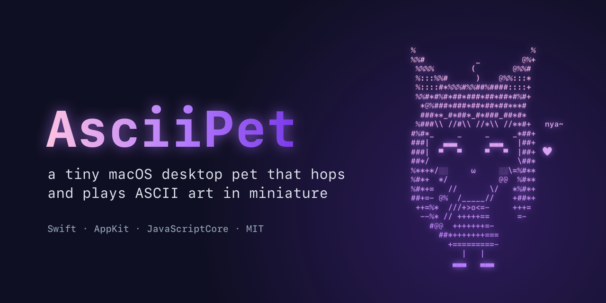
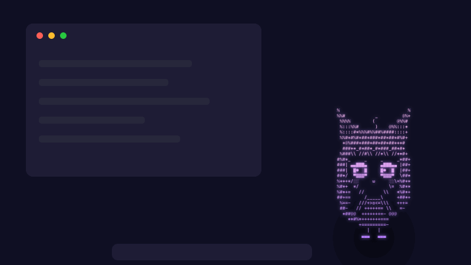
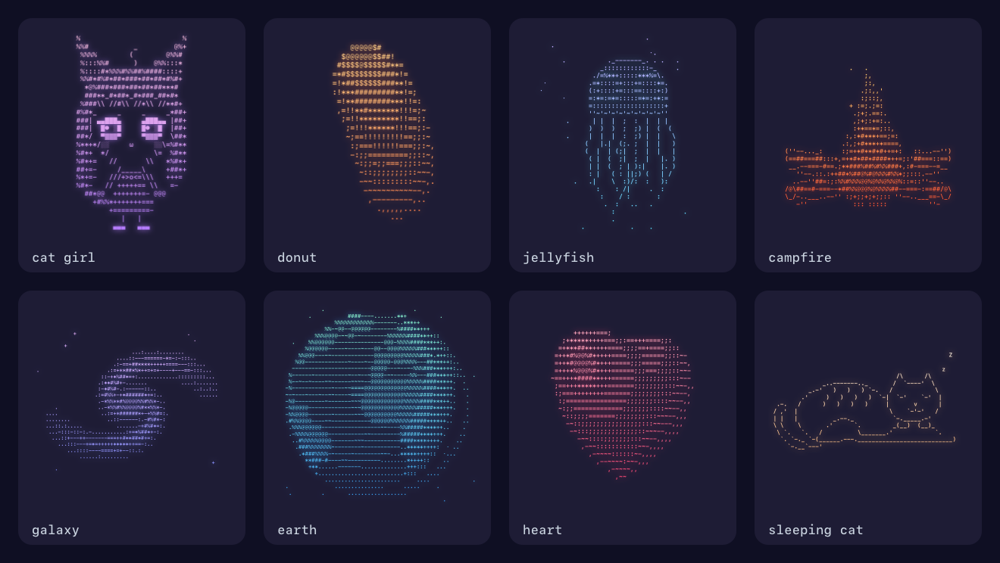

<p align="center">
  
</p>

<p align="center">
  <a href="#установка"></a>
  
  <a href="LICENSE"></a>
  <a href="https://ascii.rest"></a>
</p>

<p align="center">
  <a href="#установка"><b>Установка</b></a> ·
  <a href="#управление">Управление</a> ·
  <a href="#анимации">Анимации</a> ·
  <a href="#как-устроено">Как устроено</a> ·
  <a href="#как-добавить-анимацию">Своя анимация</a> ·
  <a href="README.md">English</a>
</p>

<p align="center">
  <picture>
    <source media="(prefers-reduced-motion: reduce)" srcset="docs/demo.png">
    
  </picture>
</p>

**Маленький питомец для рабочего стола Mac.** Сидит в углу экрана и показывает ASCII-анимации: крутящийся
пончик, галактику, спящего кота, кошкодевочку, которая машет в ответ. Время от времени подпрыгивает.
Клик — следующий трюк, зажать — перенести в другое место.

Нативный Swift, без Electron: около 20 МБ памяти и 1–4% одного ядра для большинства анимаций.

## Что умеет

- **11 анимаций,** у каждой свой цветной градиент: десять с [ascii.rest](https://ascii.rest) и кошкодевочка,
  нарисованная для этого проекта.
- **Как живой.** Приседает, прыгает, сплющивается при приземлении и меняет анимацию прямо в воздухе.
- **Не мешает.** Переносится куда угодно, хоть на другой монитор. Прозрачная часть окна пропускает клики,
  значка в Dock нет.
- **Бережёт Mac.** Замирает, когда экран спит, и не прыгает сам при включённом «Уменьшить движение».
  [Замеры](#замеры) — ниже.

## Установка

Нужны macOS 14 Sonoma или новее (Apple Silicon или Intel) и Command Line Tools
(`xcode-select --install`), сам Xcode не нужен.

Склонируйте репозиторий и выполните в его папке:

```bash
./scripts/build-app.sh --install
```

Скрипт соберёт универсальный `AsciiPet.app`, скопирует его в `~/Applications` и запустит.
Без `--install` — только сборка в `build/`.

> [!NOTE]
> Приложение подписано ad-hoc и не нотаризовано. Скачанный готовый `AsciiPet.app` Gatekeeper заблокирует.
> Соберите приложение из исходников или, проверив его, снимите флаг карантина:
> `xattr -dr com.apple.quarantine AsciiPet.app`

## Управление

| Действие | Что произойдёт |
|---|---|
| Клик по питомцу | Прыгнет и в воздухе сменит анимацию |
| Зажать и подержать (или сразу потянуть) | Поднимется — переносите куда угодно, место запомнится |
| Правый клик по питомцу или значок-лапка в строке меню | Меню: анимация, автосмена (выкл / 30 с / 1 мин / 5 мин), размер (96 / 128 / 176 pt), «Вернуть в угол», фон (без фона / тёмный / светлый), прыжки, запуск при входе, язык |

Меню говорит на English, Русский и 中文 — выбирается в пункте **Language / Язык**. По умолчанию английский.

## Анимации

<p align="center">
  
</p>

Кошкодевочка нарисована для этого проекта: моргает, дёргает ушком, виляет хвостом и машет лапкой с «nya~».
Пончик, сердце, медуза, костёр, галактика, Земля, чёрная дыра, узел, бабочка и спящий кот —
с [ascii.rest](https://ascii.rest), автор [@bas3line](https://github.com/bas3line).

## Как устроено

- **Анимации запускаются как есть.** Каждая анимация ascii.rest — чистая функция на TypeScript
  `frame(t) → строка`, без DOM и зависимостей. `scripts/fetch-pieces.sh` берёт ascii.rest на зафиксированном
  коммите и склеивает анимации из `Resources/pieces.json` esbuild-ом в `Resources/pieces.js`. Приложение
  выполняет этот бандл в JavaScriptCore: это оригинальный код, а не порт, и WebView не нужен.
- **Отрисовка.** `AsciiLayer` ставит глифы по строгой сетке, ячейка вдвое выше своей ширины — как задумано
  в ascii.rest. Символы, которых нет в SF Mono, берутся из запасного шрифта и центрируются в ячейке. Глифы
  служат маской для градиентного слоя, поэтому у каждой анимации свои цвета.
- **Энергия.** Не больше 20 к/с: на 128 pt это не отличить от 30. Кадр, совпадающий с предыдущим,
  не перерисовывается. Тяжёлая анимация получает бюджет на JS — 8% ядра, но не меньше 10 к/с. В покое таймер
  тикает с частотой анимации, 60 Гц включается только на время прыжка. Когда экран спит или окно не видно,
  всё останавливается.

### Зачем подпись с `allow-jit`

JavaScriptCore внутри стороннего приложения включает JIT только при entitlement
`com.apple.security.cs.allow-jit`. Без него анимации работают в 15–20 раз медленнее: пончик тратит 5.9 мс
на кадр вместо 0.28 мс. `build-app.sh` подписывает приложение ad-hoc с hardened runtime и этим entitlement
(`Resources/AsciiPet.entitlements`). `swift run` подходит для отладки, но производительность меряйте только
на собранном `.app`.

### Замеры

Apple M4 Pro, 128 pt, без фона, прыжки и автосмена выключены; среднее за 18 с после прогрева.

| Анимация | CPU, % одного ядра |
|---|---|
| Спящий кот | 0.9 |
| Кошкодевочка | 3.1 |
| Пончик | 3.5–4.0 |
| Костёр (самый тяжёлый, работает в рамках бюджета JS) | 10 |

Памяти — около 20 МБ. Такую лёгкую периодическую работу macOS отдаёт энергоэффективным ядрам.

## Как добавить анимацию

Меню строится по `Resources/pieces.json`: по записи на анимацию в порядке меню — `id`, название на каждом языке
и цвета градиента (`top`, `bottom` в виде `RRGGBB`):

```json
{ "id": "donut", "title": { "en": "Donut", "ru": "Пончик", "zh": "甜甜圈" }, "top": "FFD58A", "bottom": "FF7A45" }
```

Если название одинаковое на всех языках, достаточно строки. Если перевода нет, показывается английское.
Новый язык — это case в `Language` в `Sources/AsciiPet/L10n.swift` и перевод в каждой строке его таблицы.

**С ascii.rest.** Добавьте запись, где `id` — имя анимации, и пересоберите. Лучше всего подходят одноцветные
анимации — без `palette` в `meta`.

```bash
./scripts/fetch-pieces.sh && ./scripts/build-app.sh --install
```

**Свою.** Положите `.ts`-файл в `pieces/` по контракту ascii.rest (`export const meta` и `default()`,
который возвращает `frame(t, env)`) и добавьте её в `pieces.json`. Пример — `pieces/catgirl.ts`; он заодно
показывает, как один раз посчитать неподвижные части, чтобы процессор тратился только на движущиеся.

**Приватную.** Анимации, которые нужны только на вашем рабочем столе, а не в репозитории (логотип,
внутренняя шутка), кладите в `local/` — эта папка в `.gitignore`. Формат тот же: `local/pieces.json`
и `local/pieces/*.ts`. Они соберутся отдельным бандлом `local/pieces.js`, попадут в приложение и встанут
в меню первыми. Всё, что отдаёте наружу, собирайте с `build-app.sh --public` — тогда их в сборке не будет.

## Структура

```
pieces/catgirl.ts         анимация кошкодевочки (контракт ascii.rest)
scripts/fetch-pieces.sh   собирает анимации из pieces.json в pieces.js
scripts/build-app.sh      собирает и подписывает AsciiPet.app, с --install ставит, с --public — без local/
Resources/pieces.json     список анимаций: порядок в меню, названия, цвета
Resources/pieces.js       готовый бандл, лежит в репозитории, чтобы сборка шла без сети
local/                    ваши приватные анимации, в .gitignore (необязательно)
docs/                     картинки для README
Sources/AsciiPet/
  App.swift               точка входа, значок в строке меню
  PetController.swift     питомец: кадры, прыжки, перенос, меню
  PetWindow.swift         прозрачная панель поверх окон
  AsciiLayer.swift        рисует кадр сеткой глифов
  PieceEngine.swift       исполняет анимации в JavaScriptCore
  Pieces.swift            читает списки анимаций
  Settings.swift          настройки: размер, фон, место, автосмена, прыжки
```

## Лицензия

[MIT](LICENSE). Анимации ascii.rest — MIT, © bas3line; подробнее — в [THIRD_PARTY_NOTICES.md](THIRD_PARTY_NOTICES.md).
